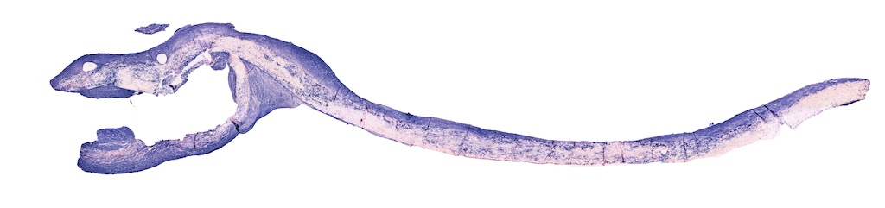
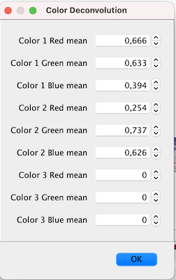
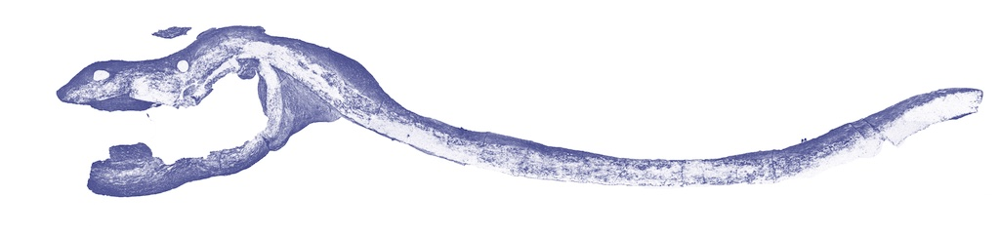
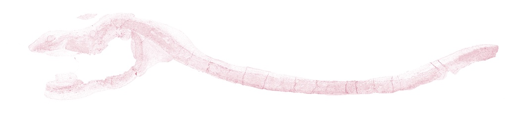
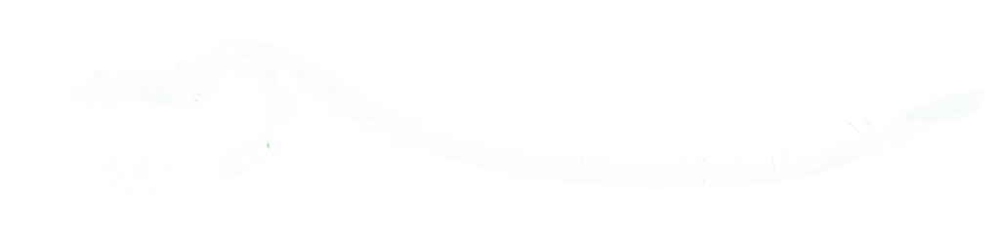

## Colour Deconvolution plugin for ImageJ2
This plugin provides similar functionality to and is also based on the excellent work done on Colour Deconvolution done by Gabriel Landini. More information found at:

https://imagej.net/Colour_Deconvolution

Gabriel's work is based on ImageJ1 and this plugin is based on ImageJ2. This allows the plugin to be used in other applications such as the excellent Knime Open source data manipulation and analysis suite:

https://www.knime.com

### Functionality of this plugin
This plugin does colour deconvolution for Microscopy images taken in RGB, 8-bit stained with 2 or 3 colours. The plugin takes the image:

and your input for each of the 2 or 3 colours into the stain dialog:

and does a colour deconvolution to arrive at 3 different images:

Image 1: based on the R, G and B values you input for colour 1.

Image 2: based on the R, G and B values you input for colour 2.

Image 3: based on the R, G and B values you input for colour 3. In this case those values were set to 0, so the image is the remainder after subtracting colour 1 and 2. In this case the values were chosen well, so the image is almost empty. When the stain values are correctly chosen, this should be the case.

For more information on the workings of this algorithm, check Gabriel Landini's excellent explanation of it here: https://blog.bham.ac.uk/intellimic/g-landini-software/colour-deconvolution-2/

This plugin is an adaptation of Gabriels work and also implements the method described in the following paper:

Ruifrok, A.C. & Johnston, D.A. (2001), ["Quantification of histochemical staining by color deconvolution"](http://www.ncbi.nlm.nih.gov/pubmed/11531144), Anal. Quant. Cytol. Histol. 23: 291-299, PMID 11531144

##Constraints

This plugin works for single images at this point, [not yet for image stacks](https://github.com/sunsear/colour_deconvolution_IJ2/issues/6). Working with multiple images is recommended to be done [using the Knime workflow we have created](https://hub.knime.com/boudewijn/spaces/Public/latest/HistogramOfDeconvolutedImagesWithOriginal).

##Installing the plugin

Download the latest version of the plugin from Maven central:
 
https://search.maven.org/search?q=g:com.github.sunsear%20AND%20a:Color_Deconvolution_IJ2

Click the download link and download the jar file. Install this into [Fiji](docs/INSTALL_FIJI.md) or Knime in the appropriate way, good to go!