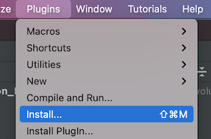
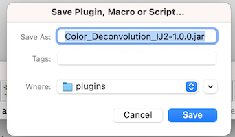
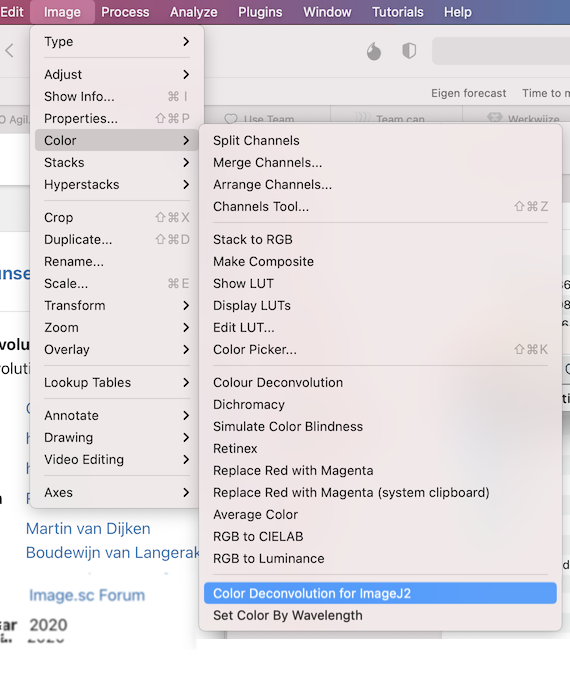

## Installing this plugin into FIJI

After [downloading the plugin from maven](DOWNLOAD_PLUGIN.md), open up FIJI. 
*  Navigate to the Plugin menu and click "Install...".

* Select the location of the jar file of the plugin. 
* Leave the defaults and choose to have FIJI install that in it's Plugin folder.

* Restart FIJI as it requests
* You should now have the plugin in the color menu:

  