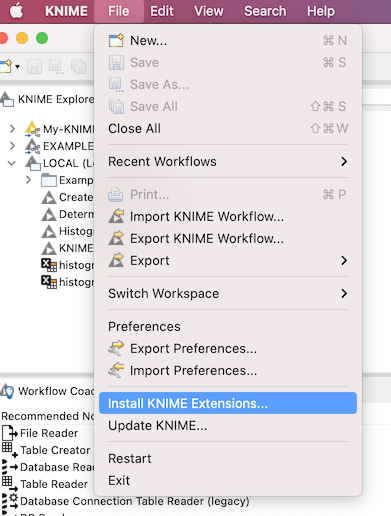

## Installing this plugin into FIJI

After [downloading the plugin from maven](DOWNLOAD_PLUGIN.md), open up Knime. 

### Adding the experimental update site
* Open the Knime Preferences.
* Navigate to Install/Update
* Open Available Software Sites
* Enable Knime Community Extensions (Experimental)
 

### Adding the ImageJ extension to Knime
* Open the File menu
* Open "Install knime extensions"

* Search for Image and install both
  * Knime Image Processing and
  * Knime Image Processing - ImageJ Integration (Beta)

* Restart Knime

### Adding the Colour Deconvolution IJ2 to Knime
* Open Preferences
* Navigate to:
  * Knime
  * Image Processing Plugin
  * ImageJ2 Plugin Install
  

* Click on the add button
* Choose the jar file you downloaded earlier
* Restart Knime

### Success
* You should now have the Colour Deconvolution block available in the Node repository of knime:

 

* Enjoy!

### Want to hit the ground running? 
Try our Knime workflow that incorporates the plugin to do analysis of a user defined selection of images: 

https://hub.knime.com/boudewijn/spaces/Public/latest/HistogramOfDeconvolutedImagesWithOriginal